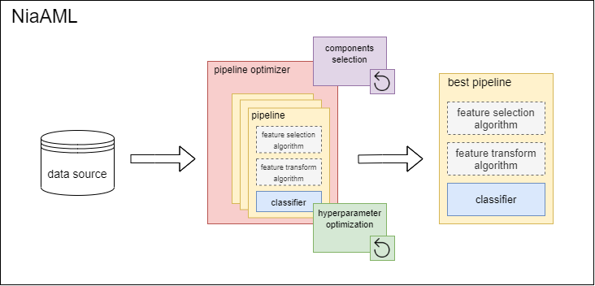

# Summary

Searching for the optimal classification pipeline in Machine Learning (ML) that provides the best results for a particular classification task involves a lot of domain-specific knowledge and numerous trial-and-error approaches. For instance, several conditions for an ML method must be fulfilled, such as proper preparation and preprocessing of input data, and selection of appropriate classifiers, their parameters, etc. Due to the specifics, mostly ML experts and data scientists were able to handle such tasks.
Automated Machine Learning methods (AutoML) are intended to automate some phases of ML tasks [@Fister2020Continuous]. With the rise of AutoML methods, dealing with the ML also became available to non-experts from other related research areas. Empirical evidence shows that automation of the optimal classifier selection process, feature preprocessing steps and their hyperparameters, can be dealt with by non-experts [@NIPS2015_11d0e628; @7280767; @Fister2020Continuous].

AutoML can be modeled as a continuous optimization problem with several potential optimization methods applied. Nature-inspired algorithms are a kind of  very efficient tool for dealing with such continuous optimization problems. We developed the AutoML framework NiaAML, written fully in the Python programming language. The framework incorporates  nature-inspired population-based algorithms to search for a good classification pipeline [@Fister2020Continuous]. NiaAML is easy to use, is expandable and can be customized to the users’ needs.

The framework is developed in a layer style layout architecture, consisting of several components, i.e. Feature Selection algorithms, Feature Transformation algorithms and classifiers. Its task is to find a perfect combination of components with proper classifiers hyperparameters` settings to build an efficient, yet customizable classification pipeline with the help of a popular collection of nature-inspired algorithms, named NiaPy [@Vrbančič2018]. Two types of optimizations in the NiaAML follow: (1) The first to find the optimal set of components for the pipeline, and (2) The second to tune the hyperparameters. Users can choose the ML components to be included into the optimization process freely, as well as select suitable fitness functions to be used for evaluation of candidate pipelines. Input data can be in the form of numerical and categorical features, as well as missing attributes, while pipelines are exported and imported as binary files for post-hoc use. Further, they can be exported as user-friendly text files that contain all of the relevant information about the pipeline and its components.

Although some similar Python frameworks for AutoML such as TPOT [@tpot] and auto-sklearn [@NIPS2015_11d0e628] exist, NiaAML is slightly different, regarding the search for a perfect pipeline with the use of nature-inspired population-based algorithms.

In conclusion, NiaAML is an AutoML framework based on nature-inspired population based algorithms. Thus, the NiaAML framework is able to find the optimal classification pipelines built on preprocessing steps and classifiers, and, simultaneously, assuring a user-friendly experience. Working with ML is also, with the help of the NiaPy framework, more easy, adaptable, expandable and customizable. Last but not least, we can assure that more of the ML components and functionalities to the NiaAML framework are yet to come.

# Statement of need

A lot of users became interested in developing practical ML applications, solving industry-related problems with ML, or even studying out of curiosity. Some of the users may not be familiar with the background or characteristics of ML algorithms and the data science field, which means that hiring some experts for consulting is unavoidable in such cases for them. In here, we see the bits of NiaAML to the ML community. Simplicity to use, extendability, adaptability and customizability are just a sample of NiaAML recognitions. The reason for its simplicity lies within the layer style architecture, which is easy to understand and allows the user to add customizable components in an easy way. An  available Graphical User Interface as a separate application makes the use of NiaAML even easier.

# References